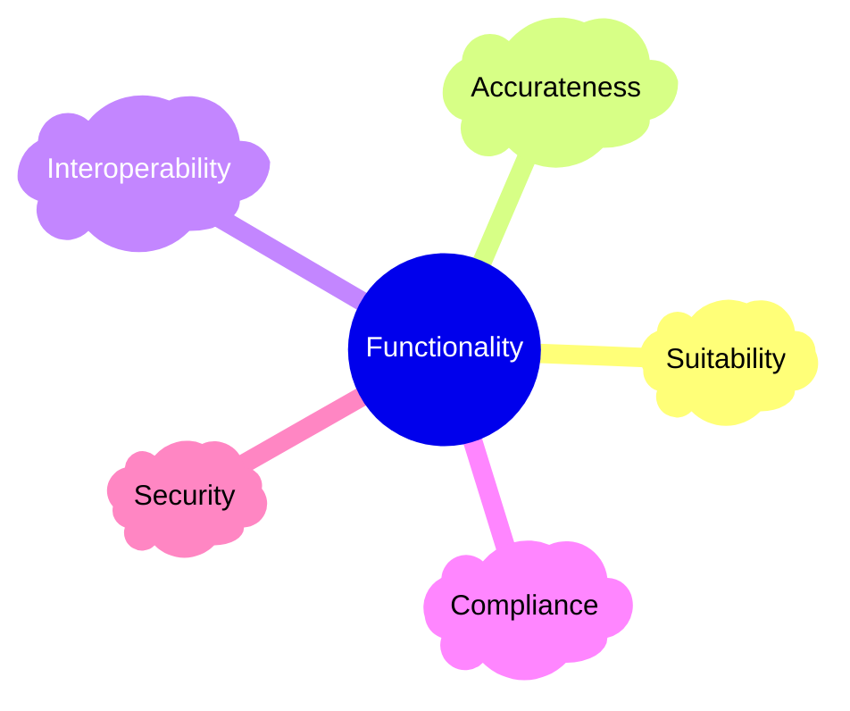
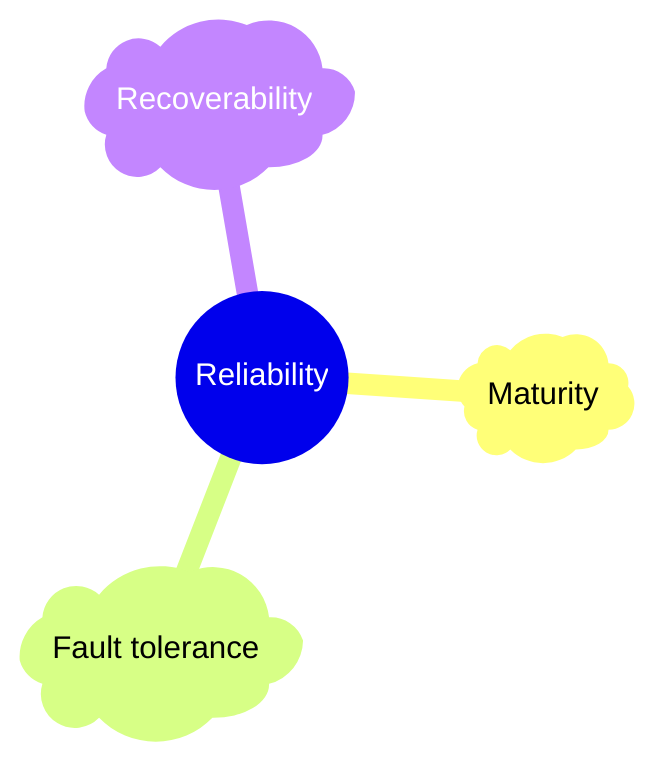
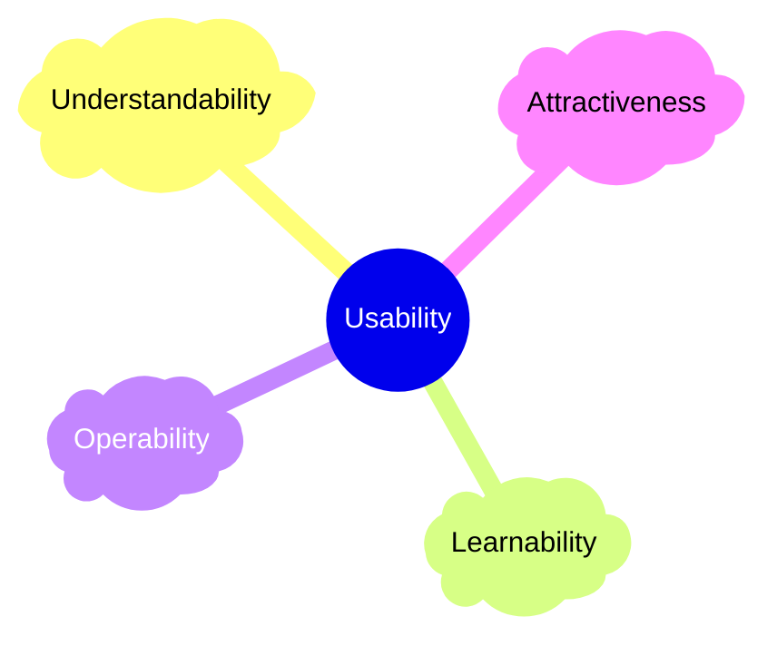
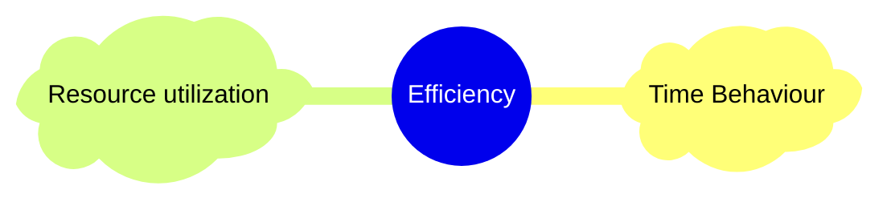
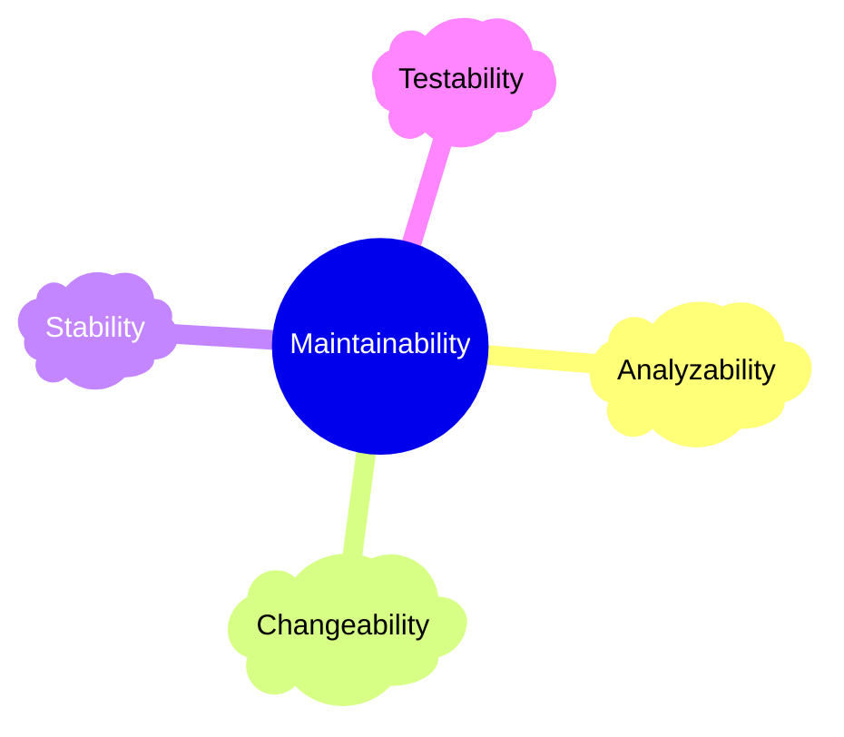
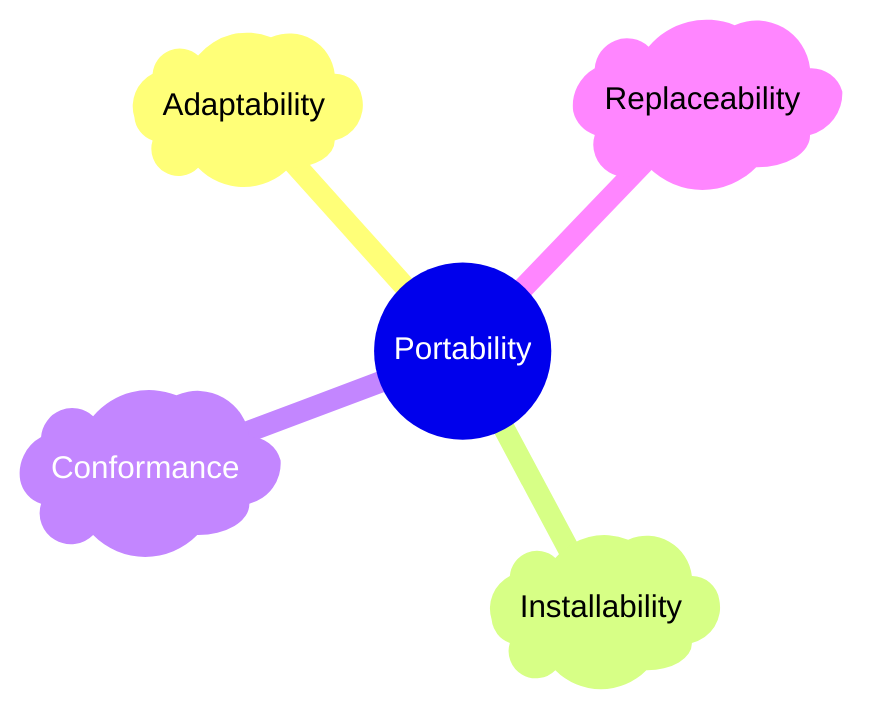

# Ch01 簡介

> 😅 大家都知道物質不滅定律; 我們更熟悉 Bug 不滅定律。

## 1.1 軟體危機

 

水能載舟亦能覆舟，軟體也是如此，有許多軟體問題造成飛機失事，造成醫療糾紛，財務的損失等。

#### 愛國者反導彈事件，毫秒的誤差

在 1991 年 2 月的第一次海灣戰爭中，一枚伊拉克發射的飛毛腿導彈準確擊中美國在沙地阿拉伯的達蘭基地（Dhahran），當場炸死 28 個美國士兵，炸傷 100 多人，造成美軍波斯灣戰爭中唯一一次傷亡超過百人的損失。

在後來的調查中發現，由於一個簡單的電腦 bug，使基地的愛國者反導彈系統失效，未能在空中攔截飛毛腿導彈。當時，負責防衛該基地的愛國者反導彈系統已經連續工作了 100 個小時，每工作一個小時，系統內的時鐘會有一個微小的毫秒級延遲，這就是這個失效悲劇的根源。愛國者反導彈系統的時鐘暫存器設計為 24 位元，因而時間的精度也只限於 24 位元的精度。在長時間的工作後，這個微小的精度誤差被漸漸放大。在工作了 100 小時後，系統時間的延遲是三分之一秒。

對一般人人來說，0.33 秒是微不足道的。但是對一個需要跟蹤並摧毀一枚空中飛彈的雷達系統來說，這是災難性的——飛毛腿導彈空速達 4.2 馬赫（每秒 1.5 公里），這個「微不足道」的 0.33 秒相當於大約 600 公尺的誤差。在達蘭導彈事件中，雷達在空中發現了導彈，但是由於時鐘誤差沒有能夠準確地跟蹤它，因此基地的反導彈並沒有發射(資料取自 維基百科)。

#### NASA 火星氣候軌道探測器

1998年，美國太空總署（NASA）發射了火星氣候軌道探測器（Mars Climate Orbiter），結果到了火星上空，便音訊全無。在多次聯絡未果之下，NASA只得宣布計畫失敗，長期的研究投資連同造價近2億美元的探測器，一同消失在無垠宇宙中。

事後調查發現，這個失敗導因於一個低級錯誤：兩個研究團隊使用的度量單位不同，一個用英制，一個用公制，導致探測器的控制程式出現混亂：原本應該從距地面140公里高度穿過火星大氣層，最後卻低於60公里，導致探測器經不起劇烈的大氣摩擦而焚燬 (資料取自 維基百科)。

👉 Mars Climate Orbiter (MCO) crash in 1998 

#### 華航名古屋空難

1994年4月26日，華航編號為B-1816的空中巴士A300-622R型客機由桃園國際機場飛往名古屋的班機，搭載271名乘客及機組員（包含正駕駛王樂琦，副駕駛莊孟容及飛航工程師），在名古屋機場降落時不幸墬毀，造成264人死亡。根據1995年1月9日聯合報引述日本名古屋空難調查委員會的調查結果，空難原因為「副駕駛在操縱飛機降落時，不小心誤將飛機設定在「重飛」（go-around，意思是中止降落重新爬升），而因駕駛員一直不知飛機設定在「重飛」的自動操作狀態下，駕駛員努力用手動操作，想要將機首壓低，而因電腦在「重飛」爬升自動操作狀態，電腦將機尾的水平安定面（horizontal stabilizer）設定到機首上升的狀態「糾正」駕駛員「錯」的壓低機首的手動操作，結果在電腦與駕駛員操作機首角度的爭鬥中，飛機向上衝的攻角過大而失去平衡，最後失速墜毀。

👉 1994 名古屋空難

一審判決忽略空中巴士公司的飛機設計問題，名古屋高等法院裁定，名古屋空難完全是因為華航駕駛操縱失誤所造成。為免再發生類似的航空事件，歐洲空中巴士公司發出維修指令，*修改A300系列的電腦程式以防止駕駛員與電腦互搶操控權而衝突*。

---

歷史上有很多軟體設計不良所造成的災害：

- 1991，愛國者飛彈失效 Patriot Missile Defense System;
- 1994 –1995，迪士尼的聖誕節電腦遊戲 Disney’s Lion King;
- 1999，NASA Mars Polar Lander;
- 2014，[臺灣新戶政系統相容問題](https://www.businesstoday.com.tw/article/category/80392/post/201402200025/)，造成系統無法製作身分證明;
- 2021，[廠商出錯-上萬學生學習歷程檔案遺失 教育部：全力救援資料](https://tw.news.yahoo.com/%E5%BB%A0%E5%95%86%E5%87%BA%E9%8C%AF-%E4%B8%8A%E8%90%AC%E5%90%8D%E5%AD%B8%E7%94%9F%E5%AD%B8%E7%BF%92%E6%AD%B7%E7%A8%8B%E6%AA%94%E6%A1%88%E9%81%BA%E5%A4%B1-%E8%B3%87%E6%96%99%E6%95%91%E6%8F%B4%E4%B8%AD-015149387.html)
- 2014，[臺灣高速公路收費系統](https://www.ithome.com.tw/people/116441)。

---

解決這些問題就是軟體工程與軟體品質工程應該要做的事。也是這門課，這本課程的目的。

> 😂 軟體和教堂非常相似——建成之後我們就開始祈禱。
>> Software and cathedrals are much the same – first we build them, then we pray. (Sam Redwine)

💡💬 有哪些你印象深刻的軟體品質事件？

## 1.2 軟體品質

> 👍 人們會忘記你做的多快，但總記得你做的多好。
>> People forget how fast you did a job- but they always remember how well you did it. (Howard Newton.)

### 1.2.1 軟體

軟體是什麼？僅是可以執行的程式碼嗎？IEEE  的定義更為廣泛：

> Computer **programs**, **procedures**, and possibly associated **documentation** and **data** pertaining to the operation of a computer system. That is, software is consisted of *code*, *procedure*, *documentation*, *data* necessary for *operating* the software system.

除了程式碼以外，操作的程序、資料、文件是「軟體」的範圍。就像華航事件一般，多少是操作的問題所引起的，所以再考量軟體品質時，不能不把這些考量在內。

> 😳 程式必須是為了給人看而寫，命令機器執行只是附帶任務。
>> Programs must be written for people to read, and only incidentally for machines to execute. (Abelson / Sussman)

### 1.2.2 品質

各行各業每一種物品或流程都有其品質的定義，很難從單一的角度來定義品質。哈佛的教授 David Garvin 在他的書中 Managing Quality, 提出從各種不同的角度來看品質:

- **超自然觀點** Transcendental view。無法直接定義品質，但看（感受）到後就知道好壞。abstract but can be recognized if it is present.
- **使用者觀點** User view。符合使用者需求的程度。fitness for purpose or meeting user's needs.
- **製造觀點** Manufacturing view。符合流程的標準，例如通過 ISO 的認證。conformance to process standard.
- **產品觀點** Product view。產品本身的材質，例如樟木所做的桌子。inherent characteristics in the product itself.
- **價值觀點** Valued based view。顧客是否願意掏錢出來買。customers' willingness to pay for a software.

💡💬 在你接觸的事物或軟體中，哪些是品質優良的？為什麼？符合 Garvin 的哪一個觀點呢？

> 👍 所謂的品質就是當沒有人看時，仍然把事情做對
>> Quality means doing it right when no one is looking.- Henry Ford

> 👍 品質不是動作，是一種習慣
>> Quality is not an act. It is a habit- Aristotle)

### 1.2.1 軟體品質

軟體有其獨特性，其品質的定義也略有不同。我們看以下三種軟體品質的定義：

> 1️⃣ 一個系統，元件或流程滿足所指定的需求的程度。
>> The degree to which a system, component, or process meets specified requirements. (Crosby, 1979)

這樣的定義著重在「需求規格」。問題是，規格書通常都寫的不完整，以致於滿足規格書的系統，卻不能滿足使用者。

> 2️⃣ 一個系統，元件或流程滿足顧客或使用者的需求或期望的程度
>> The degree to which a system, components, or process meets customer or user needs or expects (Juran, 1998)

這樣的定義加強了使用者的需要與期望。但難道只要符合使用者的期待就是好的軟體嗎？Pressman  的定義加強了「專業軟體」的期望，例如在可維護性等特性，這些是使用者不會期待的特性，但卻是與品質有著強烈的關聯。

**Software Quality**: 
> 3️⃣ 符合明訂的功能與效能需求，明訂的開發標準，及非明定的專業軟體特性的程度。
>> Conformance to explicitly state functional and performance requirements, explicitly documented development standards, and implicit characteristics that are expected of all professionally developed software (Pressman)

這樣的定義似乎聽之有理，但仍然模糊。我們透過「品質模型」的描述，可以更了解何謂軟體品質。

> 👍 測試技巧可以短時間培養，建立品質文化需要長時間培養

## 1.3 品質模型

每一個產業都有各自的品質模型，做簡易家具的不會考慮到「維護性」的議題，椅子壞了換掉就是了，但汽車產業就一定要考慮到維護性，所以維護性是汽車產業的品質模型中的品質特性。

👉 不同物品的品質特性各有不同

擴充性和跨平台執行就不是汽車產業重要的品質項目之一，但對軟體產業來說卻是非常的重要。不同產業、物品有其不同的品質模型。軟體品質模型有很多，例如 McCall, Boehm's Quality model, FURPS+ model 和 ISO 9126 ，以下我們介紹 ISO 9126 的品質模型。

### 1.3.1 ISO 9126

ISO 9126 將品質分為六大特性，如 Fig ISO ，每一個特性下又分為若干個次因子，以下分項說明。

        
👉 ISO: ISO 9126 軟體品質模型

#### 一、功能性 Functionality

功能性是最基本的品質要素。

- **功能正確性** Accurateness 功能的運作是否正確，例如計算帳戶的餘款是否正確。
    - This refers to the correctness of the functions, an ATM may provide a cash dispensing function but is the amount correct?
- **規格合適性** Suitability 功能特性是否符合軟體的規格或該系統的特性。
    - This is the essential Functionality characteristic and refers to the appropriateness (to specification) of the functions of the software. 例如 Evernote 在 2015 加入了一個 chat 的功能，一個筆記軟體是否需要一個談天功能？
- **相互運作性** Interoperability 
    - 和其他元件或系統的互動是否正確。這個特性與系統的「可整合性」有很大的關係。目前許多的系統都提供 API (Application Interface) 讓該系統可以容易的和其他的系統或模組整合，其 interoperability 就比較好。這個特性也有助於可維護性，如果是在維護階段，因為需求的變更需要修改時，我們透過 API 來做局部的修改，而不是改變內部的程式碼，其變動性就會比較低。
- **規範符合性** Compliance 
    - 是否符合特定業界標準與規範或法律。例如我們產生的格式是否符合 JSON格式、是否符合 SCORM 標準等。
- **安全性** Security 
    - 是否能夠阻擋非法的存取或控制。This subcharacteristic relates to unauthorized access to the software functions.

	
> 🫣 我們有時間做多餘的功能，卻沒有時間把必要的功能做對。

---

#### 二、可靠性 Reliability

可靠性主要考慮系統是否能夠持續性維持其功能的運作。有些系統一開始可以運作正常，但遇到一些外在因素（例如網路斷了，硬碟滿了）就無法回復（即便網路已經好了）或造成災難性的問題，就是可靠性不佳。可靠度的檢查通常需要一段較長的時間，例如一個月或是一年。

可靠度也與系統的回復能力有關係，系統失效後如果能夠立即恢復正常可靠度也還可接受，但若要停很久或是回復有部分的資料遺失就表示可靠度差。如果有一間公司每一天做一次磁帶備份，則系統出現嚴重問題時，需要將磁帶的東西倒回系統，中間就可能喪失一天的資料，而且磁帶的回復所需要的時間會比較久。如果是使用備援的架構，資料在寫入時是同時寫入兩個系統，當其中一個出現問題可以立刻切換到另一個系統，其可靠度就比較好。當然，所需要花費的經費就比較高。

- **成熟度** Maturity 失效的次數越少成熟度越高。
    - This subcharacteristic concerns frequency of failure of the software. 
    - 可靠度的評量通常可用 MTTF（mean time to failure） 來計算，就是平均多久失效一次。
- **容錯度** Fault tolerance 
    - 當環境或其他元件出錯時，能夠持續保持一定的運行的能力，能容忍錯誤的能力。The ability of software to withstand (and recover) from component, or environmental, failure.
- **回復性** Recoverability 
    - 當環境或其他元件出錯時，能夠回復到正常運行的能力。例如有些系統要一天後才能回復，有些系統指需要停機一小時。有一些系統一個星期才備份一次，所以系統回復時可能喪失一個星期的資料，就是回復性差。

---

#### 三、可用性 Usability

「這個系統好難用！」常常會聽到這樣的抱怨，系統就算功能正常，如果很難使用最後也可能因為沒人使用而失敗。例如 ATM 自動提款機上出現的提款金額： $1000.00, $2000.00 $3000.00，功能沒有問題，但使用者卻可能誤以為要領的十萬，二十萬與三十萬，由於ATM 上不可提領零錢，小數點下兩位事實上是沒有意義的，只會造成誤解。

- **易了解性** Understandability  
    - 系統的功能或概念是否容易了解？是否符合使用者所認知的心理模型？設計上如果可以有一些擬真的設計可以提昇意了解性。例如電子書的設計再翻頁時做出3D  的翻頁效果，就可以幫助亦了解性。
- **易學習性** Learnability 
    - 需要花多少力氣來學習？最好的設計是不需要說明書，使用者一看就知道如何使用。但許多新架構新功能是不太可能不透過學習的，但必須要容易學習，只教一次就會使用。例如 iPhone 在 kill App 時需要長按該 App, 等待刪除符號出現後在刪除即可。第一次需要人教，但只要一次之後就不會忘記，就是一種好的設計。
- **易操作性** Operability  
    - 在指定環境下操作是否容易？Ability of the software to be easily operated by a given user in a given environment.

後續我們在系統測試時會提到介面設計的一些原則，幫助檢驗介面的可用性。

可用性如何檢驗？我們可以透過學習的時間數或是產能來做量化的計算。例如你設計一個需要資管人員輸入的收費單系統，如果有經驗的資管人員一小時只能打10 個停車單，表示系統的設計有問題。如果設計上有很多快速鍵，移動也很方便，一個資管人員一小時可以打上30-40 個停車單。

> 🫠 如今的程式是一場工程師和上帝的競賽，工程師要開發出更大更好、傻瓜都會用到軟體; 而上帝在努力創造出更大更傻的傻瓜。目前為止，上帝是贏的。
>> Programming today is a race between software engineers striving to build bigger and better idiot-proof programs, and the universe trying to produce bigger and better idiots. So far, the universe is winning. (Rick Cook)

---

#### 四、效能 Efficiency

主要著眼在系統提供功能時系統資源被使用的狀況：磁碟空間，記憶體空間，網路用量等。

附帶一提，許多品質因子是相互有關係的，例如有效性與可用性是息息相關的- 如果效能太低，可用性是不可能高的。
  
- **時間效能** Time behavior  回應時間的長短。或是單位時間能夠處理的量。
- **資源效能** Resource behavior  
    - 消耗資源的多寡。例如  memory, cpu, disk and network usage。一般而言，時間效能越好資源校能越差，反之亦然。
    - 例如一個系統需要上傳照片，但解析度的要求並不高，現代多半用收機拍照後上傳，檔案可能上到5M，當量大的時候就會造成很大的負擔。如果我們能夠在系統上傳之時做壓縮或是轉換其解析度，這系統吃的資源就不會那麼重了。

> 💡 時間效能和資源效能常常會相互衝突，設計需要取捨-- 這也是為什麼品質沒有絕對，需要與使用者或設計師商討。

---

#### 五、可維護性 Maintainability

容不容易找出錯誤並進而修復錯誤是「可維護性」所關注的。使用者通常會忽略這個因子，（因為不關他的事），也因此常常會忽略。軟體公司的主管急著系統上線，也不太會關心這一點。工程師雖然關心，但常因為時程壓力而忽略掉，或是覺得程式是自己寫的維護一定沒有問題，所以也常常忽略。系統過了幾年，換了幾個人維護後，可維護性就更困難了。

此因此與系統的結構有很大的關係，包含程式的可讀性，複雜性和模組性。
  
- **可分析性 Analyzability** 是否容易找出錯誤的原因。系統運行的時候如果能夠留下 log，則有助於其可分析性。
- **可變動性 Changeability**	要花多少力氣來改變系統？例如新增一個功能需要花幾個人月（man-power, man-month）。
- **穩定性 Stability** 對系統變動的敏感度，系統變動時對其他部分所造成的負面衝擊。例如一個人事的系統模組增加的了一個人員型態，居然導致財務結算的系統錯誤，其系統的敏感度太高，可能是當初設計的時候模組沒有切好，彼此的相依性太高所致。
- **可測試性 Testability** 當系統變動時需要花多少 effort 來做確認測試？
    - 系統的可測試性高不高？測試環境是否容易建立？虛擬模組容不容易建置？是否有相關的測試資料？
    - 自動化測試。edx 是一個多人線上學習 MOOCs 系統，它是用 python 開發的開源系統，裡面除了很多實踐功能的 python 以外，也同時具備了很多它的測試程式，可見得哈佛的團隊在開發這個系統的同時，有特別的注意到可測試性。

           

---

> 😎 任何你寫的程式，超過 6 個月不去看它，當你再度開啟時，看起來都像是別人寫的。
>> Any code of your own that you haven't looked at for six or more months might as well have been written by someone else. (Eagleson's law)

---

> 😅 傻瓜都能寫出電腦能理解的程式。優秀的工程師寫出的是人類能讀懂的程式。
>> Any fool can write code that a computer can understand. Good programmers write code that humans can understand. (Martin Fowler)

---

#### 六、可移植性 Portability

可移植性考慮到系統能夠到適應到新的環境的能力。如果一個系統功能正確，可靠性高，執行很有效率，也很容易維護，但卻只能在某一特定機型、特定作業系統、特定組織環境下運作，當我們想把它移植到新的環境時就會出錯，那麼他也不是一個好系統。一來你不能重用它，為你創造更大的利益，二來系統軟體或硬體是不斷演進的，總有一天你的系統需要移植到新的平台。

  
- **適應性 Adaptability** 對於新的作業系統，作業環境或新規格的適應性。Characterizes the ability of the system to change to new specifications or operating environments.
- **易安裝性 Installability** 花多少力氣安裝系統？Characterizes the effort required to install the software.
- **相容性 Conformance** 和功能性裡面的 compliance 類似，但這裡強調的是相容性，例如與某資料庫的相容性。Similar to compliance for functionality, but this characteristic relates to portability. One example would be Open SQL conformance which relates to portability of database used.
- **易置換性 Replaceability** 	容易抽換某元件的能力。Characterizes the plug and play aspect of software components, that is how easy is it to exchange a given software component within a specified environment. 
    - 我們在 Blackboard 系統上開發了許多與學習相關的功能（例如點名），但這些系統是用 Blackboard 的 Building Block 框架來做的，是一個特有的框架。當我們移植到 Moodle 的系統後這些功能就不能用了。許多後期開發的模組是一般的 web 程式（建構在 .Net上），它就很容易的與新的 Moodle 整合。
    * Eclipse 這個開發工具平台採取的架構就是可以擴充的 plug in 架構，所以許多第三方的開發者可以自己開發許多套件來整合。EclEmma，一種測試包含度的外掛，就是其中一個例子。

💡❓ 軟體會不會生鏽？

---

### 1.3.2 ISO 9126 的度量

> 📌 除了上帝，我只相信數字。
>> In God we trust. All others must bring data. ~by *W. Edwards Deming*

ISO 9126 除了定義有哪些品質項目以外，它還定義了這些品質項目的量化檢驗方法（metric）。有三個：

- **內部度量 internal metric**。不需透過程式的執行，直接檢驗程式碼本身。例如模組的耦合力、註解的撰寫狀況等都屬於。一個註解率較高的系統通常其可維護性會比較高。
- **外部度量 external metric**。需要透過程式的執行才能度量。例如消耗多少記憶體，平均的回應時間等。
- **使用品質度量 quality in use metric**。使用上的度量，通常與 usability 相關。

---

## 1.4 品質控制與確保

### 1.4.1 製造業的品質控管

製造業如何控制品質呢？通常有兩種方法。(1)  透過機械化來控制品質。機器不會對於重複的工作感到繁瑣，無聊，也因此叫不會犯錯。然而在生產的過程避免不了人工。(2)  如果機器無法代勞，需要人工的，就讓每個人做單一重複不會犯錯的工作。所以我們看到生產線上總是那麼多人的作業人員單調的、反覆的做同一件事，就是為了避免犯錯。

品質管理問題：製造過程從設計到生產有數十道到幾百道程序。每一道程序都可能影響到後面的品質。如何透過製造流程的改善（process improvement）提高良率，一直是製造工業的重要課題。改善品質方式：

- **自動化**。製造過程中使用機器-自動化，因為機器不容易犯錯且可不斷重複單調無聊工作。但部分工作不能由機器來做，製造過程如何做到品質控管？
- **簡單化**。需要人工的部份，讓每個生產線員工只做一件簡單到不容易出錯的工作。生產線員工不需太聰明，借此降低成本。生產線將複雜產品製造切割成許多小步驟，可在短時間及最少技術內完成，發現產品的問題、錯誤，並不難。

以「簡單化」來說，*軟體和製造業不同不一樣，我們無法讓第一個人寫第一行，第二個人寫第二行*。所以品質確保得用其他的方式。

---

### 1.4.2軟體品質控制與確保

一個不成熟的軟體公司，就如同 FIG_SQA 第一階段一樣，軟體開發完後就直接發佈了，但這種方法會產生很多問題，甚至導致退貨賠款，於是知道開發完後需要做一些測試（code review, testing）- 此時公司進步到第二階段。

但慢慢發現，到了產品完成才做測試已經太慢了（生米都煮成熟飯了，要改也困難），於是把檢查的動作往前提，開始進行規格及設計的檢查（design review, specification review）。

規格及設計的檢查可以在早期發現問題並且即早解決，對於品質的提升很有幫助。但開發人員對這些活動並不熟悉或不喜歡，常常會忽略不做。於是公司進階到第四階段-- 一群稽核人員被組織起來，定期的檢查該做的流程是否進行。一個軟體品質管理的團隊與組織文化慢慢的被建立。

為了確保品質的優良所進行的所有活動，都可視為 SQA 的活動。

> ✅ **軟體品質保證 (SQA)** 是一個確保開發的軟體符合既定或標準化的品質規格的過程。 SQA 是軟體開發生命週期 (SDLC) 中的一個持續過程，它會定期檢查已開發的軟體，以確保其符合所需的品質指標。
>> *Software quality assurance (SQA)* is a process that ensures that developed software meets and complies with defined or standardized quality specifications. SQA is an ongoing process within the software development life cycle (SDLC) that routinely checks the developed software to ensure it meets desired quality measures.

SQA 通常被翻譯成「軟體品質保證」，或「品保」，但這樣的翻譯會有些誤解，以為經過 SQA 就能「保證」系統完全沒有問題-- 事實上這是不可能的，僅能說是降低出錯的風險。*本講義中翻譯為「軟體品質確保」。

---

#### 品質控制 vs. 品質確保

更細部的說，我們會區分品質控制（quality control; QC）與品質確保（quality assuracne; QA）。QC 會在製造開發的各個不同的階段衡量元件， 確保該元件在可接受的範圍內，也就是說，符合所規範的規格。QA 則稽核流程以確保製造流程符合所建立的指引與標準。也就是說，QC 著重在過程中產物稽核，QA 著重在過程是否符合規範或標準。

> ✅ **品質控制 (QC)** 會在各個製造階段對組件進行測量。 QC 會確保組件在可接受的「公差」範圍內，即它們不會偏離約定的規格。
>> **Quality Control (QC)** would measure the *components, at various manufacturing stages. QC would make sure the components were within acceptable 'tolerances', i.e. they did not vary from agreed specifications. 
 
> ✅ **品質保證**不會參與生產過程本身（包括產品的品質控制），但會審核整個流程，以確保遵循既定的準則和標準。然後，品質保證小組會為持續改善流程提供意見（指標或測量方法）。 
>> **Quality Assurance** would not take any part in the manufacture process itself (including Quality Control of the product) but would audit the *process} to make sure the established guidelines and standards were being followed. The QA group would then give input (metrics or measures) into a process of continuous improvement. 

---

> 😢 如果建築工人像工程師寫軟體那樣蓋房子，那第一隻飛來的啄木鳥就能毀掉人類文明。
>> If builders built buildings the way programmers wrote programs, then the first woodpecker that came along wound destroy civilization. (Gerald Weinberg)

---

> 👍 建立品質文化，文化是每個人都習以為常，不需要制度去規範就會去做的事。

---

### 1.4.3 軟體品質成本

錯誤百出產品上線後，會招致很多「代價」，例如重新設計，賠款，聘任更多客服人員等。這個代價就是「品質成本」。我們可以降低品質成本-- 如果能夠早一點發現品質問題並且提前解決的話。

- **預防成本 Prevention costs**。預防產生錯誤的成本。就像是為了避免生病，買了一些保健品或運動所帶來的成本。Prevent defect goes inside your system. Approach: training, quality planning, formal technical reviews
- **檢驗成本 Appraisal costs**。在產品上線前檢驗是否有錯誤的成本。Find the defect before you release it; testing and fix them
- **失效成本 Failure costs**。產品在上線後，因為失效所帶來的成本。Rework, repair, failure mode analysis, product return and replacement, help line support

一般而言-- 就像我們的健康一樣-- 預防成本與檢驗成本都比失效成本來得低，所以我們應該進行預防與定期的檢驗。但這並不容易，學校及社會不斷的宣導預防與檢驗的重要性，這幾年大家才慢慢的重視。軟體品質活動也是一樣，需要不斷的宣導。

> 👍 預防重於治療，在軟體工程也適用。

---

## 📖 1.5 案例

### 1.5.1 出勤刷卡系統的移植 🎫

雄太曾經為某研究機構開發針對專案人員的出勤刷卡系統，透過刷卡來確定其上下班是否正常，整個流程包含多個系統：
  
- 行政人員在 A 系統（以 client-server 架構開發）所做的中輸入參與人員的資料，包含她所參與的計畫; 
- 專案主持人登入 B系統（web 架構）做一個人員確認;
- 行政人於把專案人員資料匯入個刷卡機的主機系統
- 專案參與人員每日做出勤刷卡的動作
- 每月結算人員的出勤狀況，如果符合要求，就會把資料彙整到撥款系統。

> 💡💬 大虎公司覺得這一套系統比他們現行的卡式打卡鐘系統好多了，希望能夠以低價的方式移植，是否可行？需要考慮什麼？

要考慮的東西很多，特別是在可移植性、維護性方面，例如：
  
- 人事系統的資料結構是否一致？各研究機構一定有自己的人事資料，是否容易與刷卡系統容易整合？
- 撥款系統的介接; 雙方的撥款系統結構是否相容。
- 需要額外安裝 A 系統，包含可能需要的資料庫 driver。
- B 系統是否容易整合到研究機構的資訊系統。

---

### 1.5.2 用 ISO 9126 談談某課程管理系統 🏫

針對某大學的課程管理與學習系統，我們試著用 ISO 9126 描述一下其品質：
  
- **Functionality:** (1) 完整的學習管理系統; (2) 和校務的資料（學生選課，老師授課的資料）可以整合; (3) 可以和 LDAP 認證系統整合。
- **Reliability:** (1) 舊的學習系統平均每年的 downtime 是 3 days; 新系統是 5hours (2) 應用 VM 提供備援機制。(3) 透過 SAN（Storage Area Network）架構，提昇備份與備援機制。
- **Usability:** (1) 移除不需要的訊息宣傳，畫面更乾淨俐落 (2) 建立「使用說明」的課程來提供操作說明與回答問題。
- **Efficiency:** (1) 透過分散式系統架構來提升效能。
- Maintainability- (1) Open source 提昇系統的可除錯性 (2) 避免修改 Moodle PHP 的程式碼，降低修改的敏感度，提昇系統的穩定度 (3) 所有的程式行為都有詳細的 log。
- **Portability:** (1) 所有校務功能都獨立到 Apps 的獨立模組，透過 SSO 做整合，可取代性高。但也因此介面會比較醜 (2) Moodle 可安裝至 Window, Unix 系列的作業系統 (3) 各 AP 採用無硬碟系統，系統容易安裝 。

---

### 1.5.3 瑞穗證券的烏龍指 📈

 

[Watch](a href="https://g.co/gemini/share/022dd19085b9)

2015 年 9 月 3 日，一個長達 10 年的訴訟終於畫下了句號。這個判例將對 IT 行業產生深遠的影響：如果程式的 bug 導致了巨大的經濟損失，應該由誰來承擔？用戶？運營商？還是系統開發商？

* 東證：系統營運單位
* 瑞穗：系統使用單位
* 富士通：系統開發單位

以下是故事的精簡版本：

2005 年 12 月 8 日，日本 J-Com 公司首次上市。瑞穗證券交易員田中君（化名）在為客戶下單時，誤將「以 61 萬日元賣出 1 股」輸入成「以 1 日元賣出 61 萬股」。儘管交易軟件發出警告，田中君仍未細看便確認，導致這筆巨額賣單進入東京證券交易所（東證）的交易盤口。

錯誤發出後，田中君試圖撤單卻被東證系統拒絕，聯繫交易所也無濟於事。交易開始後，該賣單瞬間將 J-Com 股價推至異常高價，隨後又因被機構瘋搶而跌停。隨後，瑞穗證券被迫反向買入股票以填補賣單，將股價推至漲停，全天造成約 270 億日元的損失。

該事件不僅影響了 J-Com 股價，還引發了市場對券商潛在虧損的恐慌，導致多家券商股價下跌，日經指數也大幅下挫。

**後續處理與訴訟**

由於 J-Com 總流通股數遠少於賣出數量，瑞穗證券最終通過現金結算，以烏龍指發生前的股價進行交割，使得總損失擴大至 400 億日元。當事人田中君並未受嚴厲懲罰，但其操作導致公司全年利潤歸零，員工年終獎泡湯。

趁機獲利的 22 家機構受到譴責，部分公司捐款成立了保護投資者基金。東證交易所因系統 bug 導致無法及時撤單而受到質疑，其社長引咎辭職。

瑞穗證券認為東證應對損失負責，但東證反駁稱是瑞穗自身操作失誤。雙方未能達成一致，瑞穗證券遂將東證及系統開發商富士通告上法庭。

**法庭審判**

訴訟查明，東證交易系統的 bug 是富士通在 2000 年的一次程式修改中無意植入的，且富士通和東證在程式測試環節均有疏忽。東京地方法院最終判定東證承擔主要責任，富士通為連帶責任人。法院認為，程式 bug 是否構成「重大過失」取決於其是否容易被發現，而非單純的系統錯誤。最終，控辯雙方在法庭上圍繞 bug 的顯著性展開激烈爭論。

最終，東京地方法院判定：... 

> [Details](https://docs.google.com/document/d/1ydO9j3cNGpYu-7nJWBNmuVUhkKrhbfWq1KYRlv1BkfM/edit?usp=sharing)

❓ 上述案例，你覺得誰給負最大責任
(1) 瑞穗：沒有他們的犯錯，根本不會有這個災難
(2) 東證：他們是系統的負責單位，該負全責
(3) 富士通：程式是他們寫的，明顯的錯誤卻沒有找出來，釀成災害

❓ 身為軟體工程師的你，受到什麼啟示？

---

## ✍️ 1.6 練習

#### 軟體危機

- 除了講義內容以外，從過去的國內外新聞裡找出2-3 個軟體品質問題的災害，描述其品質所造成的影響，造成的原因，可能的避免方法？
- 「YouBike 微笑單車」公共自行車租賃系統於 2016 年 8 月 31 日凌晨 1 時停車柱當機，導致全國 2 萬 2,000 輛公共自行車停止使用，該系統在 9 月 2 日凌晨修復完畢，但造成許多民眾通勤受阻。請描述此一事件之原因。

#### 軟體品質

- 以下何者正確？	
	- 廣義的說，所謂的軟體包含程式碼、操作的程序、各式的說明文件、與需要執行該程式的資料。
	- 只要符合顧客的要求，就是一個具備好品質的軟體。
	- 軟體的品質取決於開發者的素質與能力，與製造它的流程無關。	
	
- 想想看，你周遭的生活中，哪些東西是你認為「品質好」的物品？試著以 `David Garvin 的品質模型` 來描述之。

#### 品質模型 

- ISO 9126 的品質度量有三種：內部、外部、使用。以下分別是屬於何種？	
	- 模組耦合率 0.38
	- 平均回應時間 2.38 秒
	- 顧客滿意度 4.28
	- 程式碼註解率 12%
- 以下問題或作法分別與哪個 ISO 9126 特性（及次因子）相關？	
	- 需求規格變了，軟體就需要大幅的修改，造成很大的人力損失。
	- 經過了教育訓練，使用者還是不太會操作該軟體。
	- 所開發的系統可以透過 LDAP (一種目錄服務標準) 和別人的帳號認證系統整合。
	- 所開發的系統提供 API 方便其他系統呼叫。
	- 開發系統時做適當的 logging，記錄適當的系統資訊。
	- 每個畫面提供 help 的按鈕，提供操作的介紹。
	- 預防錯誤資料所成的系統崩潰。 
	- 系統每天晚上都重新開機才會正常。		
- ISO 9126 是國際性的品質模型，其包含哪六個品質特性？
- ISO 9126 除了定義品質的要素以外，也定義了衡量這些品質的度量（metric），分別為 internal metrics, external metrics, quality in use metric, 這三者有何差別？
- ISO 9126 Reliability 包含哪些品質次因子？
- Docker 是最近很盛行的技術，它和虛擬機器（Virtual Machine）有何差異？它幫助工程師們容易達到 ISO 9126 的哪個特點？
-  就你以前開發過的系統，從 Maintainability 或 Usability 來討論其品質的好壞。需要展開到次因子，每一個次因子用 1-5 分來表示，並說明為什麼？
-  找一個你使用過軟體（最好是 Server 等級），從 ISO 9126 的品質角度討論其優劣。
-  選擇兩個功能類似的軟體（例如開發專用的編輯器），從 ISO9126 的六個層面來評估品質。每一個層面應該僅可能提供量化的數據來說明其品質。

#### 品質控制與保證

- 以下哪些活動算是品質確保活動？(1) 系統測試 (2) 規格書審查 (3) 效能測試 (4) 合約簽訂 (5) 系統開發 (6) 開發流程稽核。
-  何謂品質成本 (quality cost)？可以分為哪三類？
- 軟體測試 (software testing) 與軟體品質保證 (software quality assurance) 有何不同？

#### 綜合

- 以下何者正確？
	- [ ] 品質控制著重物品是否符合品質或規範，品質確保著重是否符合流程規範。
	- [ ] 進行「軟體品質確保」活動，可確保軟體品質無虞。
	- [ ] 即早發現，即早治療 - 這句話依然是用於軟體測試。
	- [ ] ISO 9126 把品質因素分常六大類，分類間沒有關係（某一品質特性的好壞不會影響另一品質的好壞）。	
-  設計一個「匯入全班成績，並且可以依據成績高低排序顯示成績」的規格書，並且避免驗收（是否為 defect）的爭議。
- MOOC 是 Massive Open Online Course, 是免費的課程可以讓上萬的人上來學習，但作業批改是一大問題（老師怎麼改上萬的作業？）。因此有 peer review （同儕互評; PR）的機制。其運作方法如下	
	- 老師批改一定量 (m) 的學生的作答後，學生開始依據這些作答做『校正』
所謂校正是學生也批改這些作答，系統計算它和老師批改的差距，差距越小，積分越高
	- 積分高到一定程度（v）後，並且批改的份數到達一定門檻 (n) 後，該學生可以成為合格的同儕審查者 
	- 成為審查者後，必須批改一定量 (k) 的學生作答才可以看到自己的成績。
	
問題：該如何測試此系統？可能會遇到什麼困難？如何解決？

---

## 參考書籍

- Jorgensen, Paul C. Software testing: a craftsman’s approach. CRC press, 2013. 
- Patton, Ron. Software testing. Vol. 2. Indianapolis: Sams, 2001. 
- Kaner, Cem, James Bach, and Bret Pettichord. Lessons learned in software testing. John Wiley \& Sons, 2008.

<!-- 
### 參考答案

#### Exercise ISO9126

以下問題或作法分別與哪個 ISO 9126 特性相關？
* (1) 需求規格變了，軟體就需要大幅的修改，造成很大的人力損失。 🔑 Maintainability.changeability  
* (2) 經過了教育訓練，使用者還是不太會操作該軟體。🔑 Usability.learnability  
* (3) 所開發的系統可以透過 LDAP和別人的帳號認證系統整合。🔑 Functionality.interoperability,  Portability。Interoperability 好通常 portability 也會好。  
* (4) 所開發的系統提供 API 方便其他系統呼叫。 🔑 Functionality.interoperability, Portability 
* (5) 開發系統時做適當的 logging，記錄適當的系統資訊。  🔑 Maintability.analyzability  
* (6) 每個畫面提供 help 的按鈕，提供操作的介紹。 🔑 Usability  
* (7) 預防錯誤資料所成的系統崩潰。  🔑 Reliability 
* (8) 系統每天晚上都重新開機才會正常。🔑 Reliability  

#### Exercise "成績匯入"

🔑 應該考慮 
1. 匯入的資料檔案格式，excel? 哪一版本？.txt? XML? JSON 格式？ 
2. 會不會有沒有成績的情況？在原檔案是如何註記？  
3. 會不會很多科目？以哪一個科目為排序依據？需不需要設定第一排序科目，第二排序科目等？該如何設定？ 
4. 如果同分該如何排序？用學號？原資料有學號嗎？
5. 成績是否用 A, B, C, E 的標記方式？哪一個算高分？
6. 資料會不會很大？超過一萬筆？有沒有效能上的考量？

-->