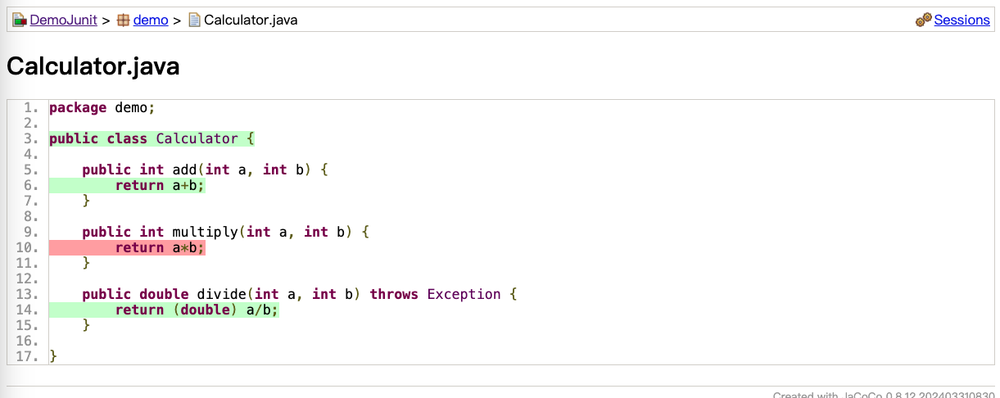

## Jacoco maven setting

The updated POM file：

```xml
<?xml version="1.0" encoding="UTF-8"?>
<project xmlns="http://maven.apache.org/POM/4.0.0"
    xmlns:xsi="http://www.w3.org/2001/XMLSchema-instance"
    xsi:schemaLocation="http://maven.apache.org/POM/4.0.0 http://maven.apache.org/xsd/maven-4.0.0.xsd">
    <modelVersion>4.0.0</modelVersion>

    <groupId>org.example</groupId>
    <artifactId>DemoJunit</artifactId>
    <version>1.0-SNAPSHOT</version>

    <properties>
        <maven.compiler.source>22</maven.compiler.source>
        <maven.compiler.target>22</maven.compiler.target>
        <project.build.sourceEncoding>UTF-8</project.build.sourceEncoding>
    </properties>

    <dependencies>

        <!-- JUnit 5 -->
        <dependency>
            <groupId>org.junit.jupiter</groupId>
            <artifactId>junit-jupiter</artifactId>
            <version>5.11.0</version>
        </dependency>

        <!--  Using org.apache.commons.lang3.StringUtils; -->
        <dependency>
            <groupId>org.apache.commons</groupId>
            <artifactId>commons-lang3</artifactId>
            <version>3.13.0</version>
        </dependency>


        <!-- read JSON file -->
        <dependency>
            <groupId>com.fasterxml.jackson.core</groupId>
            <artifactId>jackson-databind</artifactId>
            <version>2.17.1</version>
        </dependency>

    </dependencies>

    <build>
        <plugins>
            <plugin>
                <groupId>org.jacoco</groupId>
                <artifactId>jacoco-maven-plugin</artifactId>
                <version>0.8.12</version>

                <executions>
                    <execution>
                        <id>prepare-agent</id>
                        <goals>
                            <goal>prepare-agent</goal>
                        </goals>
                    </execution>
                    <execution>
                        <id>report</id>
                        <phase>verify</phase>
                        <goals>
                            <goal>report</goal>
                        </goals>
                    </execution>
                </executions>
            </plugin>
        </plugins>
    </build>

</project>
```

* `prepare-agent` 會在 `initialize` 的 phase, 通常不用特別設定。`prepare-agent` 會在啟動 Jacoco 的代理程式，用來產生測試覆蓋的資訊。
* `report` 可以在 `test` 或 `verify` 的階段，上面的設定，我們設定在 `verify` 的階段。
* 透過 maven, 執行 clean --> test --> verify 來產生測試報告。
* 開啟 `target/site/jacoco/index.html` 就可以看到報告





## Maven lifecycle:

1. **validate** – Checks the project and ensures it is correct and all necessary information is available.
2. **initialize** – Initializes the build state, setting up any necessary properties.
3. **generate-sources** – Generates any source code that needs to be included in compilation.
4. **process-sources** – Processes the source code (e.g., filtering properties).
5. **generate-resources** – Generates any resources needed by the project.
6. **process-resources** – Copies and processes resources into the output directory, ready for packaging.
7. **compile** – Compiles the source code of the project.
8. **process-classes** – Post-processes the compiled bytecode, if necessary.
9. **generate-test-sources** – Generates any test source code.
10. **process-test-sources** – Processes the test source code.
11. **generate-test-resources** – Creates resources needed for testing.
12. **process-test-resources** – Copies and processes test resources into the test output directory.
13. **test-compile** – Compiles the test source code.
14. **process-test-classes** – Post-processes the compiled test bytecode.
15. **test** – Runs the unit tests using a testing framework (e.g., JUnit).
16. **prepare-package** – Performs any necessary operations before packaging.
17. **package** – Packages the compiled code (e.g., into a JAR or WAR).
18. **pre-integration-test** – Executes any steps needed before integration tests.
19. **integration-test** – Deploys the package to an environment where integration tests can run.
20. **post-integration-test** – Executes cleanup steps after integration tests have run.
21. **verify** – Runs checks to ensure the quality of the package.
22. **install** – Installs the package into the local Maven repository (for use as a dependency in other projects).
23. **deploy** – Copies the final package to a remote repository for sharing with other developers or projects.

These phases represent the default lifecycle, meaning they are executed in this order if no specific configuration overrides them. Each phase is executed only if it and any previous phases are triggered as part of a build (e.g., running `mvn install` would trigger all phases up to and including `install`).