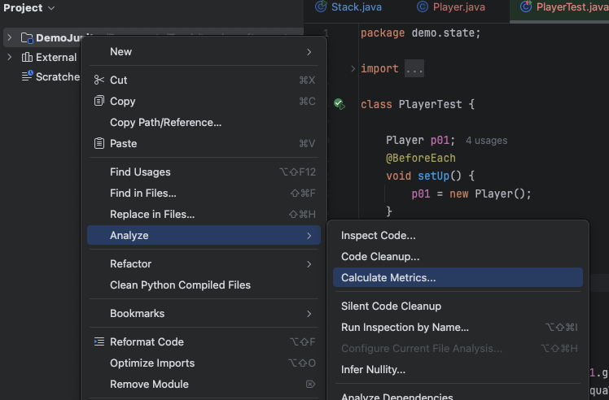
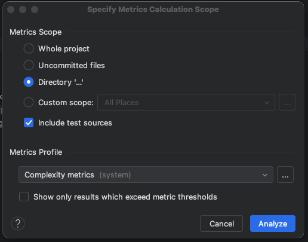

# Code Metrics

## Install

Install `Cyclomatic Complexity` metric to your Intellij
* Intellij >> Settings >> Plugins >> Marketplace >> search `MetricsReloaded`
  * Install
  * Restart
  * Choolse a file, package or whole project
    * On the project, right click the mouse, choose "Analyze" >> "Calculate metrics"
    * Select the "Complexity metrics"
    * Click "Analyze"
  * On the bottom panel, you will see the metrics

## Metrics

好的，MetricsReloaded 是一個用於測量和分析程式碼指標的 IntelliJ 外掛。您提到的這些指標在軟體工程中都非常重要，它們幫助開發人員評估程式碼的品質、可維護性和可測試性。

以下是對您提到的五個指標的詳細介紹：

---

## 💻 MetricsReloaded 外掛程式碼指標介紹

### 1. v(G) (Cyclomatic Complexity) - 圈複雜度

| 定義 | 程式碼的**線性獨立路徑**的數量。 |
| :--- | :--- |
| **白話計算方法** | 把它想像成程式碼中**決策點**（Decision Points）的數量加上 1。每個 `if`、`while`、`for`、`case`（在 `switch` 裡）、`catch`、三元運算子 `? :`，以及邏輯運算子 `&&` 和 `\|\|` 都算作一個決策點。 |
| **隱含的意義** | **數值越大 $\rightarrow$ 程式碼越複雜**。 |
| **建議值** | 通常認為單一方法的 **v(G) 不應超過 10**。超過 10 就意味著程式碼可能難以理解、難以測試，並且容易出錯。 |

> **簡單來說：** $v(G)$ 告訴你一個方法有多少種不同的執行路徑。路徑越多，你需要設計的測試案例就越多，出錯的風險也越高。

### 2. WMC (Weighted Methods per Class) - 類別加權方法數

| 定義 | 類別中**所有方法的複雜度總和**。在 MetricsReloaded 中，這個複雜度通常是使用 **v(G) (圈複雜度)** 來計算。 |
| :--- | :--- |
| **白話計算方法** | 簡單來說，就是把這個類別中**所有方法的 $v(G)$ 值加總起來**。例如，如果一個類別有三個方法，它們的 $v(G)$ 分別是 3, 5, 2，那麼 $WMC = 3 + 5 + 2 = 10$。 |
| **隱含的意義** | **數值越大 $\rightarrow$ 類別功能越多、越複雜**。 |
| **建議值** | 雖然沒有絕對標準，但 **WMC 過高**通常表示這個類別承擔了**過多的職責**（God Object/Bloated Class）。它可能違反了**單一職責原則 (SRP)**，難以維護和重用。 |

> **簡單來說：** $WMC$ 是衡量一個類別**總工作量**的指標。太高的 $WMC$ 意味著這個類別應該被拆分成幾個更小的、職責單一的類別。

### 3. OCavg (Class Average Method Complexity) - 類別平均方法複雜度

| 定義 | 類別中**所有方法複雜度的平均值**。 |
| :--- | :--- |
| **白話計算方法** | 將 $WMC$ 的值，除以類別中**方法的總數量**。$$\text{OCavg} = \frac{\text{WMC}}{\text{類別中的方法總數}}$$ |
| **隱含的意義** | **數值越大 $\rightarrow$ 類別中的**_**平均方法**_**越複雜**。 |
| **與 WMC 的區別** | $WMC$ 關注**類別的總體大小**，$OCavg$ 關注**類別中每個方法的複雜度平均水準**。如果 $WMC$ 很高但 $OCavg$ 很低，表示類別有很多**簡單**的方法。如果兩者都高，則表示類別有很多**複雜**的方法。 |

> **簡單來說：** $OCavg$ 告訴你這個類別的每個方法平均來說有多「燒腦」。

### 4. CogC (Cognitive Complexity) - 認知複雜度

| 定義 | 衡量程式碼對**人類讀者**來說，**理解起來有多困難**。它會考慮程式碼的結構化流、中斷（例如 `break`、`continue`）以及巢狀結構的深度。 |
| :--- | :--- |
| **白話計算方法** | **與 $v(G)$ 相似，但更著重於人類的理解難度**。它懲罰**巢狀結構**（例如 `if` 裡面還有 `if`），以及一些會中斷程式碼正常執行流程的結構（例如 `goto` 或 `break`）。它不會計算那些只是流程控制但不會增加理解難度的結構（例如單純的方法呼叫）。 |
| **隱含的意義** | **數值越大 $\rightarrow$ 程式碼越難以理解和維護**。這是現代軟體工程中非常重要的指標，因為它直接關注開發人員的閱讀體驗。 |
| **建議值** | 與 $v(G)$ 相似，單一方法的 **CogC 數值越低越好**。高 $CogC$ 是**重構**（Refactoring）的強烈訊號。 |

> **簡單來說：** $CogC$ 是 $v(G)$ 的升級版，專門評估**人腦處理**這段程式碼的難度。

### 5. LOC (Lines of Code) - 程式碼行數

| 定義 | 程式碼中的**物理行數**，通常只計算**實質程式碼**行（不含註釋和空行）。 |
| :--- | :--- |
| **白話計算方法** | 計算類別、方法或檔案中**非空白且非註釋**的程式碼行。 |
| **隱含的意義** | **數值越大 $\rightarrow$ 類別或方法越長**。 |
| **建議值** |
    * **高 $LOC$** 的類別或方法通常與**高 $WMC$** 和**高 $v(G)$** 同時出現，表示程式碼**過長、難以掌握**。
    * **方法**的 $LOC$ 應保持簡短（例如不超過 50 行），以符合「方法應該只做一件事」的原則。 |

> **簡單來說：** $LOC$ 衡量程式碼的物理長度。長的方法或類別很難一眼看清全貌。

---

## 📊 總結與關聯性

MetricsReloaded 提供的這些指標通常需要**結合起來**看，才能全面評估程式碼品質：

| 情境 | 指標組合 | 潛在問題 | 解決建議 |
| :--- | :--- | :--- | :--- |
| **方法過於複雜** | $v(G)$ 或 $CogC$ **高** | 單個方法邏輯分支太多，難以測試和理解。 | 應將複雜方法**拆解**成多個更小、功能單一的方法。 |
| **類別職責過多** | $WMC$ **高** 且 $LOC$ **高** | 類別承擔了過多的責任（神級物件）。 | 應使用**設計模式**，將類別**拆分**成多個更專業的類別。 |
| **方法複雜度不一** | $WMC$ 高，但 $OCavg$ 低 | 類別有很多簡單方法，但可能有一兩個**極度複雜**的方法。 | 專注於重構那幾個特別複雜的方法。 |

這些指標是您維護高品質程式碼庫的強大工具。

您想讓我針對其中一個指標，例如 **Cognitive Complexity (CogC)**，提供更多關於如何降低它的技巧嗎？