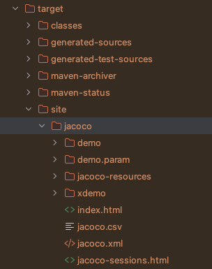

## White box testing (LAB)

### Basic coverage

針對課堂案例，進行涵蓋度測試的分析：
```java
input A,B,X 
if (A>1) and (B=0) then
  Y=A 
if (A=2) or (X>1) then
  Y=X 
print Y
```

* 使用 Intellij 工具
* 使用 Jacoco 外掛工具

### Triangle

使用白箱測試的技巧，對以下的程式進行測試：
* [Triangle](../../Intellij/DemoJunit/src/main/java/demo/Triangle.java)
    * 透過 Intellij 上的 Coverage 檢驗測試涵蓋度, 並說明 class, method, line, branch 涵蓋度的意義; branch 涵蓋度和講義中的條件涵蓋度、分支涵蓋度有何差異？
    * 補充測試資料以提高涵蓋度;
    * 若不能達到分支涵蓋度百分百？ 為什麼？ 如何改善？
    * 透過 POM 設定安裝 [Jacoco 工具](#jacoco-maven-setting)，產生測試報告
    * 測試報告中每一行的顏色代表意義為何？


### Binary Search

在黑箱測試中，我們提及 Binary search 的黑箱測試技巧，

1. 請依據以下規格設計 JUnit 測試案例：

> 設計一個 `BinarySearch` 類別，包含 `search(int key, int[] array)` 方法，該方法接受一個目標數字 `key` 和已排序的整數陣列 `array`，並回傳一個 `Result` 物件；`Result` 包含布林值 `Found`，表示是否找到目標數字，及整數 `index`，為目標數字在陣列中的索引位置（若未找到則為 -1）。

```java
    public static class Result {
        public boolean Found;
        public int index;

        public Result(boolean found, int index) {
            this.Found = found;
            this.index = index;
        }
    }

    public Result search(int key, int[] array) 
```

2. 請透過 Coverage 檢驗涵蓋度，如果不足，請添加測試案例以達到涵蓋度百分百。

ps. [Binary Search 完整程式碼](../../Intellij/DemoJunit/src/main/java/demo/BinarySearch.java) 

3. 探討 All-pair testing


### Loan Calculator

我們曾透過 All-pair testing 來設計測試案例，其強度介於 weak coverage 與 strong coverage 之間。

1. 設計一個測試案例集，滿足 weak coverage, 檢驗其 branch coverage
2. 設計一個測試案例集，滿足 all-pair coverage, 檢驗其 branch coverage
3. 設計一個測試案例集，滿足 string coverage, 檢驗其 branch coverage

需求規格與設計規格如下：

>  設計一個貸款利率計算程式，根據貸款年限、貸款金額、是否為青年及婚姻狀況計算利率；規則如下：基礎利率為 5%，貸款超過 10 年折扣 0.5%，超過 20 年折扣 1%；若貸款金額超過 500 萬則再每 100萬 減少 0.1%; 若申請者為青年則減少 1%，若已婚則再減少 0.5%；利率最低為 2%。


```java
public class LoanCalculator {

    public static double calculateInterestRate(int years, double amount, boolean isYouth, boolean isMarried) 
```

ps. [LoanCalculator 完整程式](../../Intellij/DemoJunit/src/main/java/demo/LoanCalculator.java)

## Jacoco maven setting

The updated POM file：

```xml
<?xml version="1.0" encoding="UTF-8"?>
<project xmlns="http://maven.apache.org/POM/4.0.0"
    xmlns:xsi="http://www.w3.org/2001/XMLSchema-instance"
    xsi:schemaLocation="http://maven.apache.org/POM/4.0.0 http://maven.apache.org/xsd/maven-4.0.0.xsd">
    <modelVersion>4.0.0</modelVersion>

    <groupId>org.example</groupId>
    <artifactId>DemoJunit</artifactId>
    <version>1.0-SNAPSHOT</version>

    <properties>
        <maven.compiler.source>21</maven.compiler.source>
        <maven.compiler.target>21</maven.compiler.target>
        <project.build.sourceEncoding>UTF-8</project.build.sourceEncoding>
    </properties>

    <dependencies>

        <!-- JUnit 5 -->
        <dependency>
            <groupId>org.junit.jupiter</groupId>
            <artifactId>junit-jupiter</artifactId>
            <version>5.11.0</version>
        </dependency>

        <!--  Using org.apache.commons.lang3.StringUtils; -->
        <dependency>
            <groupId>org.apache.commons</groupId>
            <artifactId>commons-lang3</artifactId>
            <version>3.13.0</version>
        </dependency>


    </dependencies>

    <build>
        <plugins>

            <plugin>
                <groupId>org.jacoco</groupId>
                <artifactId>jacoco-maven-plugin</artifactId>
                <version>0.8.12</version>

                <executions>
                    <execution>
                        <id>prepare-agent</id>
                        <goals>
                            <goal>prepare-agent</goal>
                        </goals>
                    </execution>
                    <execution>
                        <id>report</id>
                        <phase>verify</phase>
                        <goals>
                            <goal>report</goal>
                        </goals>
                    </execution>
                </executions>
            </plugin>
        </plugins>
    </build>
</project>
```

* `prepare-agent` 會在 `initialize` 的 phase, 通常不用特別設定。`prepare-agent` 會在啟動 Jacoco 的代理程式，用來產生測試覆蓋的資訊。
* `report` 可以在 `test` 或 `verify` 的階段，上面的設定，我們設定在 `verify` 的階段。
* 透過 maven, 執行 clean --> test --> verify 來產生測試報告。
* 開啟 `target/site/jacoco/index.html` 就可以看到報告





### Maven lifecycle

好的，這是一份 Maven 專案生命週期的階段說明，以下用繁體中文解釋：

這份列表描述了 Maven 專案的預設生命週期，也就是說，如果沒有特別設定去覆寫，這些階段會依照這個順序執行。只有當該階段以及所有之前的階段被觸發（例如，執行 `mvn install` 會觸發所有直到包含 `install` 的階段）時，每個階段才會被執行。

* **clean** - 清理專案建置產生的檔案。
    * **pre-clean** – 執行清理前需要的設定。
    * **clean** – 移除先前建置產生的所有檔案，例如 `target` 目錄。
    * **post-clean** – 執行清理後需要的處理。
* **validate** - 驗證專案是否正確，所有必要的資訊是否可用。
    * **validate** – 檢查專案的 `pom.xml` 檔案是否有效，以及建置環境是否滿足基本要求。
* **compile** - 編譯專案的原始碼。
    * **generate-sources** – 產生任何需要在編譯過程中包含的原始碼。
    * **process-sources** – 處理原始碼，例如進行屬性過濾。
    * **compile** – 將專案的 `.java` 原始碼編譯成 `.class` 位元組碼。
* **test** - 執行專案的單元測試。
    * **generate-test-sources** – 產生任何需要的測試原始碼。
    * **process-test-sources** – 處理測試原始碼。
    * **generate-test-resources** – 建立測試所需的資源檔案。
    * **process-test-resources** – 複製並處理測試資源檔案到測試輸出目錄。
    * **test-compile** – 編譯測試原始碼。
    * **process-test-classes** – 對已編譯的測試位元組碼進行後續處理。
    * **test** – 使用配置的單元測試框架（例如 JUnit）執行測試。
* **package** - 將編譯後的程式碼打包成可發布的格式（例如 JAR、WAR 等）。
    * **prepare-package** – 在打包之前執行任何必要的準備操作。
    * **package** – 將編譯後的類別和資源檔案組合成最終的發布包。
* **verify** - 驗證打包的檔案是否有效且符合品質標準。
    * **pre-integration-test** – 執行整合測試前需要的任何設定。
    * **integration-test** – 執行整合測試，通常在部署的環境中進行。
    * **post-integration-test** – 在整合測試完成後執行清理步驟。
    * **verify** – 執行檢查以驗證包的完整性和品質。
* **install** - 將打包好的檔案安裝到本地 Maven 儲存庫中，以便其他本地專案可以使用。
    * **install** – 將打包好的工件（例如 JAR 檔案）及其 POM 檔案複製到本地 Maven 儲存庫的適當位置。
* **site** - 產生專案的網站文件。
    * **pre-site** – 執行產生網站前需要的設定。
    * **site** – 根據專案的配置和插件產生網站文件。
    * **post-site** – 執行產生網站後需要的處理。
    * **site-deploy** – 將產生的網站部署到指定的伺服器。
* **deploy** - 將最終的發布包部署到遠端 Maven 儲存庫，以便與其他開發人員或專案共享。
    * **deploy** – 將最終的工件及其 POM 檔案上傳到配置的遠端 Maven 儲存庫。